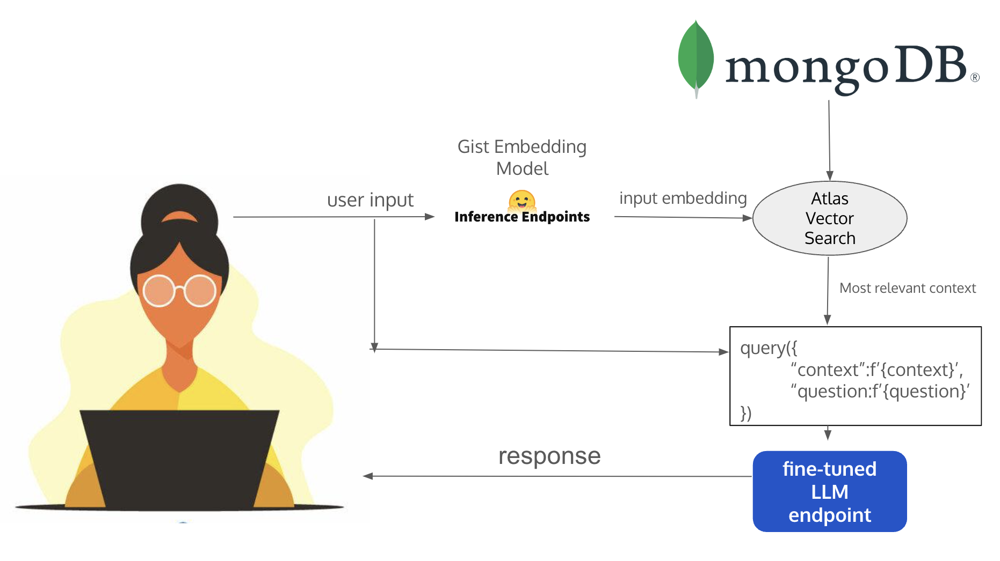

# Duke Masters in AI Chatbot Assistant

By Daniel Medina, Suneel Nadipalli, Sri Veerisetti, Dominique Buford

Project frontend: https://github.com/medinardaniel/aipi-chatbot-frontend
Project backend: https://github.com/medinardaniel/aipi-chatbot-flask

## Project Overview
This project involves creating a chatbot assistant designed to answer questions for potential or admitted students of the Duke Masters in Artificial Intelligence program. The assistant covers a wide range of topics related to the program, utilizing advanced AI and machine learning techniques.

## Data Preparation

1. **Web Scraping & FAQ Document Compilation**
   - Extract relevant data and FAQs from multiple sources to cover extensive topics related to the Duke AI program.

2. **Generate and Store GIST Embeddings**
   - Utilize GIST embeddings to represent scraped data, storing these embeddings in a MongoDB collection for efficient retrieval.

3. **Question and Answer Generation**
   - Employ GPT 3.5 to generate dynamic Questions and Answers based on the scraped data and compiled documents.

## Model Finetuning

- **Dataset**: Composed of [Context, Question, Answer]
- **Process**:
  1. Format the prompt into a template suitable for model input.
  2. Tokenize the formatted prompt.
  3. Utilize the Mistral7B model with a BitsAndBytes config.
  4. Convert model to PEFT (PyTorch Efficient Finetuning) format.
  5. Set LORA (Low-Rank Adaptation) parameters and general model parameters.

## Application Architecture

- **Frontend**: Built with Next.js, handles user interactions.
- **Backend**: A Flask application deployed on Heroku to manage data processing and model interactions.
- **Data Handling**:
  1. GIST model endpoint in Hugging Face embeds the user message.
  2. MongoDB Atlas vector search retrieves similar data chunks.
  3. A dedicated fine-tuned model endpoint in Hugging Face processes the most similar chunk and user message to generate responses.
 

## Evaluation

### Performance Metrics

- **Average Precision**: 57.7%
- **Average Recall**: 59%
- **Average F1-Score**: 54.7%

### Custom Metrics

- **Stringent Factual Accuracy**:
  - Cosine Similarity: Average 60%, Max 95.5%, Min 33.4% across 4 sample questions.
  - Human Evaluation: 78%
  
- **Similar Question Consistency**:
  - Average Cosine Similarity: 53.1%
  
- **Language Structure Testing**:
  - Average Cosine Similarity: 61%

## Conclusion

This chatbot assistant is tailored to effectively support inquiries regarding the Duke Masters in AI program, leveraging cutting-edge AI techniques to provide accurate and relevant information. The system's architecture and evaluation metrics ensure that the assistant performs efficiently and reliably across various types of user queries.

